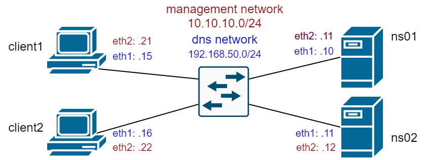

**Задание**

Взять стенд https://github.com/erlong15/vagrant-bind, добавить еще один сервер client2.

Завести в зоне dns.lab имена:

web1 - смотрит на клиент1;
web2 - смотрит на клиент2

Завести еще одну зону newdns.lab, завести в ней запись:

www - смотрит на обоих клиентов

Настроить split-dns:

клиент1 - видит обе зоны, но в зоне dns.lab только web1;
клиент2 - видит только dns.lab

*) настроить все без выключения selinux


Топология сети:




**Выполнение задания**

Результатом выполнения ДЗ стали две ansible-роли, которые поднимают стенд следующего содержания:

Сервер **ns01** выступает мастером, сервер **ns02** - слэйвом. Конфигурация **bind** на серверах написана с использованием **view** для реализации **split-dns**.

Реализована возможность динамического обновления зоны `ddns.lab` клиентов **client1** и **client2**. Так как эта зона расположена в директории `/var/named/dynamic/` (в которой рекомендовано располагать динамические зоны), то она наследует тип SELinux `named_cache_t`, который позволяет динамически обновлять зону с других хостов. Если бы зона располагалсь в какой-то другой директории, то для этой директории и её содержимого неоходимого было бы изменить SELinux тип на `named_cache_t`. Подобные манипуляции с SELinux были проделаны мной [здесь](https://github.com/vasilij-m/otus-linux-2-12).

***Проверка ДЗ***

1. Клиент1 - видит обе зоны, но в зоне dns.lab только web1:

```
[root@client1 ~]# dig web1.dns.lab +short @192.168.50.10
192.168.50.111
[root@client1 ~]# dig web1.dns.lab +short @192.168.50.11
192.168.50.111
[root@client1 ~]# dig web2.dns.lab +short @192.168.50.10
[root@client1 ~]# dig web2.dns.lab +short @192.168.50.11
[root@client1 ~]# dig www.newdns.lab +short @192.168.50.10
192.168.50.103
[root@client1 ~]# dig www.newdns.lab +short @192.168.50.11
192.168.50.103
```

Видим, что запросы отрабатываются в соответсвии с заданием как на мастере, так и на слэйве.

2. Клиент2 - видит только dns.lab:

```
[root@client2 ~]# dig web1.dns.lab +short @192.168.50.10
192.168.50.111
[root@client2 ~]# dig web1.dns.lab +short @192.168.50.11
192.168.50.111
[root@client2 ~]# dig web2.dns.lab +short @192.168.50.10
192.168.50.112
[root@client2 ~]# dig web2.dns.lab +short @192.168.50.11
192.168.50.112
[root@client2 ~]# dig www.newdns.lab +short @192.168.50.10
[root@client2 ~]# dig www.newdns.lab +short @192.168.50.11
[root@client2 ~]#
```

Видим, что запросы отрабатываются в соответсвии с заданием как на мастере, так и на слэйве.

3. *) настроить все без выключения selinux

Проверим, что SELinux на **ns01** включен, и обновим зону `ddns.lab` с обоих клиентов с помощью `nsupdate`:

```
[root@ns01 ~]# sestatus
SELinux status:                 enabled
SELinuxfs mount:                /sys/fs/selinux
SELinux root directory:         /etc/selinux
Loaded policy name:             targeted
Current mode:                   enforcing
Mode from config file:          enforcing
Policy MLS status:              enabled
Policy deny_unknown status:     allowed
Max kernel policy version:      31
```
```
[root@client1 ~]# nsupdate -k /etc/named.zoneupdate.key 
> server 192.168.50.10
> zone ddns.lab
> update add test1.ddns.lab. 3600 A 192.168.50.201
> send
> quit
```
```
[root@client1 ~]# dig test1.ddns.lab +short @192.168.50.10
192.168.50.201
[root@client1 ~]# dig test1.ddns.lab +short @192.168.50.11
192.168.50.201
```
```
[root@client2 ~]# dig test1.ddns.lab +short @192.168.50.10
192.168.50.201
[root@client2 ~]# dig test1.ddns.lab +short @192.168.50.11
192.168.50.201
```
Видим, что зона `ddns.lab` обновилась, информация о ней доступна как на мастере, так на слэйве.


* ***Материалы, которые помогли при выполнении:***
 * https://kb.isc.org/docs/aa-00851
 * https://kb.isc.org/docs/aa-00296
 * https://kb.isc.org/docs/aa-00608
 * http://sudouser.com/nastrojka-dynamic-dns-na-baze-bind9-i-nsupdate.html
 * https://andreyex.ru/linux/komandy-linux-i-komandy-shell/kak-ispolzovat-komandu-dig-dlya-zaprosa-dns-v-linux/


